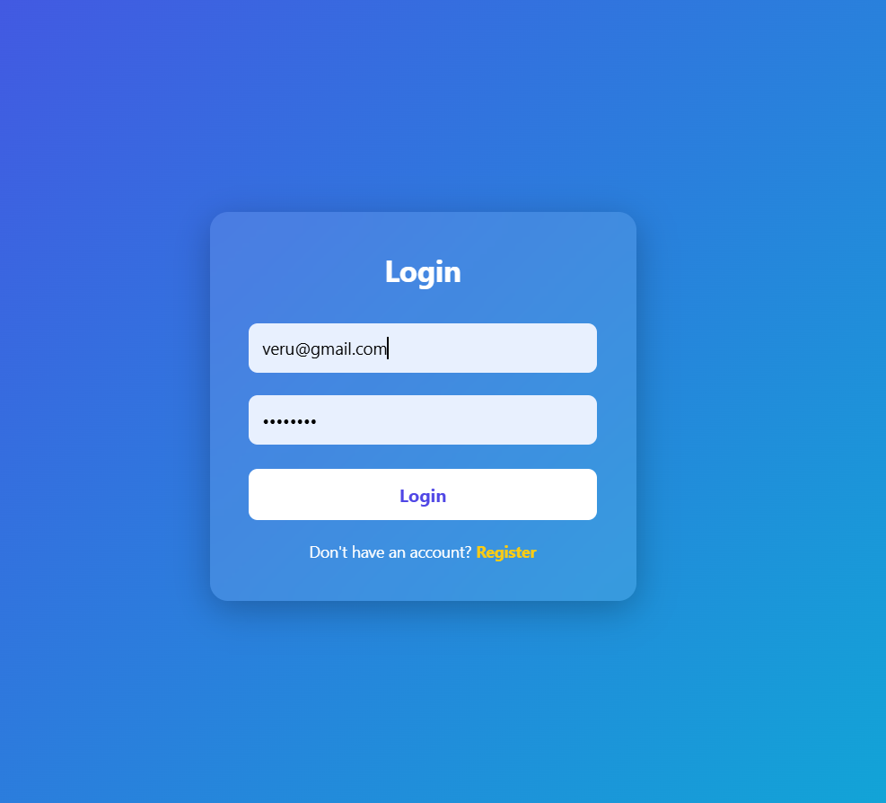
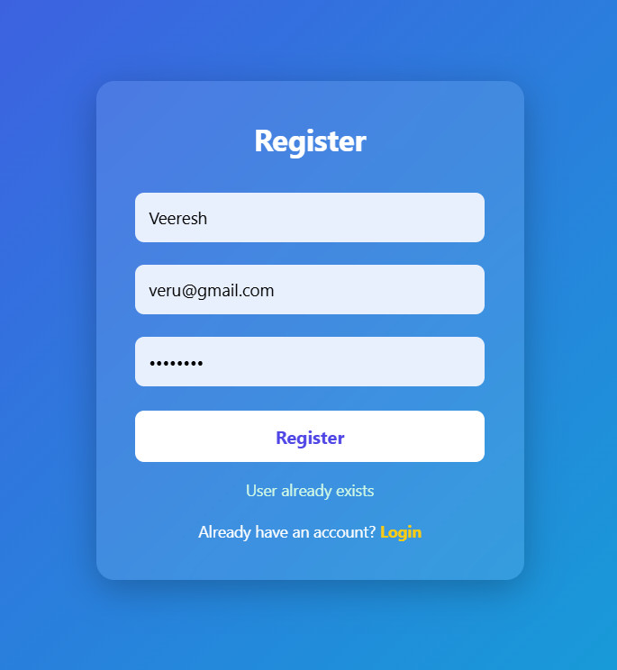

# 🔐 Fullstack Login System

A complete full-stack login and registration system built using React, Node.js, and MySQL.

---

## 🚀 Tech Stack

- Frontend: React (Vite)
- Backend: Node.js + Express
- Database: MySQL
- Authentication: bcrypt

---

## ✨ Features

- User Registration
- Login System
- Password Encryption
- Welcome Page after Login
- Logout functionality

---

## ⚙️ How to Run

#Backend
cd backend
npm install
node server.js

#Frontend
cd react-front
npm install
npm run dev
🗄️ Database
CREATE DATABASE login_system;

USE login_system;

CREATE TABLE users (
  id INT AUTO_INCREMENT PRIMARY KEY,
  name VARCHAR(100),
  email VARCHAR(100) UNIQUE,
  password VARCHAR(255)
);

## Screenshots

👨‍💻 Author

Varun H
GitHub: https://github.com/VARUN19206
